# Cloud Architecture for Low-Latency Streaming Pipeline

This document describes the Azure cloud resources required to run the low-latency weather data streaming pipeline with AutoLoader in legacy file notification mode.

## Architecture Diagram

```mermaid
flowchart TB
    subgraph Azure["Azure Subscription"]
        subgraph StorageAccount["Azure Storage Account"]
            subgraph Container["Blob Container"]
                LandingZone["📁 landing/\n(GRIB files arrive here)"]
                SilverLayer["📁 silver/\n(forecast.zarr synced here)"]
                Checkpoints["📁 checkpoints/\n(Spark streaming state)"]
            end
            
            subgraph QueueService["Queue Storage"]
                EventQueue["📬 databricks-auto-ingest-*\n(Created automatically by AutoLoader)"]
            end
        end
        
        subgraph EventGrid["Azure Event Grid"]
            Subscription["📡 Event Subscription\n(BlobCreated events)\n(Created automatically by AutoLoader)"]
        end
        
        subgraph ServicePrincipal["Azure Service Principal"]
            SP["🔑 App Registration\n+ Client Secret"]
        end
        
        subgraph DatabricksAccount["Azure Databricks Account (Unity Catalog)"]
            subgraph Catalog["Unity Catalog"]
                ExternalLoc["📍 External Location\n(points to Container)"]
                
                subgraph Schema["Schema"]
                    VolumeLanding["📦 Volume: bronze\n(/landing)"]
                    VolumeSilver["📦 Volume: silver\n(/silver)"]
                end
            end
        end
        
        subgraph DatabricksWorkspace["Azure Databricks Workspace"]
            Cluster["🖥️ All-Purpose Cluster\nDBR 15.4 LTS\n(Single Node, 32+ cores)"]
            
            subgraph Workflow["Databricks Workflow"]
                StreamingJob["⚡ Streaming Job\n(AutoLoader + foreachBatch)"]
            end
            
            SecretScope["🔐 Secret Scope\n(Service Principal creds)"]
        end
    end
    
    %% Data flow
    ExternalFiles["🌐 External Data Source\n(GRIB files)"] -->|"writes"| LandingZone
    LandingZone -->|"triggers"| Subscription
    Subscription -->|"pushes events"| EventQueue
    EventQueue -->|"polls"| StreamingJob
    StreamingJob -->|"reads GRIB"| VolumeLanding
    StreamingJob -->|"syncs Zarr"| VolumeSilver
    
    %% Permission relationships
    SP -.->|"Contributor +\nStorage Queue Data Contributor"| StorageAccount
    SP -.->|"EventGrid EventSubscription\nContributor"| EventGrid
    ExternalLoc -->|"grants access"| VolumeLanding
    ExternalLoc -->|"grants access"| VolumeSilver
    SecretScope -.->|"provides creds"| StreamingJob
    
    %% Cluster relationship
    Cluster -->|"runs"| StreamingJob

    classDef storage fill:#e6f3ff,stroke:#0066cc
    classDef compute fill:#fff2e6,stroke:#cc6600
    classDef security fill:#ffe6e6,stroke:#cc0000
    classDef catalog fill:#e6ffe6,stroke:#00cc00
    
    class StorageAccount,Container,QueueService,LandingZone,SilverLayer,Checkpoints,EventQueue storage
    class Cluster,StreamingJob,Workflow compute
    class SP,SecretScope security
    class ExternalLoc,VolumeLanding,VolumeSilver,Catalog,Schema catalog
```

## Resource Details

### Azure Storage Account

| Resource | Purpose |
|----------|---------|
| **Blob Container** | Holds all data for the pipeline |
| `landing/` | Landing zone where GRIB files arrive |
| `silver/` | Silver layer containing the synced `forecast.zarr` |
| `checkpoints/` | Spark Structured Streaming checkpoint location |
| **Queue Storage** | Receives file notification events |
| `databricks-auto-ingest-*` | Queue created automatically by AutoLoader on first stream start |

### Azure Event Grid

| Resource | Purpose |
|----------|---------|
| **Event Subscription** | Watches the container for `BlobCreated` events and pushes them to the Storage Queue. Created automatically by AutoLoader when using legacy file notification mode. |

### Azure Service Principal

Required for legacy file notification mode. The service principal credentials must be stored in a Databricks secret scope.

**Required IAM Roles:**

| Role | Scope | Purpose |
|------|-------|---------|
| **Contributor** | Storage Account | Create queues and event subscriptions |
| **Storage Queue Data Contributor** | Storage Account | Read/delete messages from the queue |
| **EventGrid EventSubscription Contributor** | Resource Group | Create/manage Event Grid subscriptions |

**Required Secrets (in Databricks Secret Scope):**

| Secret Key | Description |
|------------|-------------|
| `clientId` | Service Principal Application (client) ID |
| `clientSecret` | Service Principal client secret value |
| `tenantId` | Azure AD Tenant ID |
| `subscriptionId` | Azure Subscription ID |
| `resourceGroup` | Resource Group containing the Storage Account |

### Azure Databricks Account (Unity Catalog)

| Resource | Configuration |
|----------|---------------|
| **External Location** | Points to the Azure Storage container using a Storage Credential |
| **Volume: bronze** | Maps to `landing/` subdirectory in External Location |
| **Volume: silver** | Maps to `silver/` subdirectory in External Location |

### Azure Databricks Workspace

| Resource | Configuration |
|----------|---------------|
| **Cluster** | All-Purpose Classic, DBR 15.4 LTS, Single Node (32+ cores recommended) |
| **Secret Scope** | Contains Service Principal credentials for AutoLoader |
| **Workflow** | Runs the streaming pipeline job on the cluster |

## Data Flow

1. **GRIB files land** in the `landing/` folder (written by external producer or upstream system)
2. **Event Grid** detects the `BlobCreated` event and pushes a message to the **Storage Queue**
3. **AutoLoader** polls the queue and receives file notifications
4. **Streaming job** forms a micro-batch of new files
5. **foreachBatch** logic:
   - Downloads GRIB files from `bronze` volume to local SSD
   - Parses GRIB and writes to local Zarr store
   - Syncs changed chunks to `silver` volume using azcopy
6. **Consumer** reads the updated Zarr from the `silver` volume

## Setup Checklist

- [ ] Create Azure Storage Account with blob container
- [ ] Create folder structure: `landing/`, `silver/`, `checkpoints/`
- [ ] Create Azure AD App Registration (Service Principal)
- [ ] Generate client secret for the Service Principal
- [ ] Assign IAM roles to Service Principal:
  - [ ] Contributor on Storage Account
  - [ ] Storage Queue Data Contributor on Storage Account
  - [ ] EventGrid EventSubscription Contributor on Resource Group
- [ ] Create Databricks External Location pointing to the container
- [ ] Create Unity Catalog Volumes for `bronze` and `silver`
- [ ] Create Databricks Secret Scope with Service Principal credentials
- [ ] Create/configure All-Purpose Cluster (DBR 15.4 LTS, single node)
- [ ] Create Databricks Workflow to run the streaming pipeline

## Related Documentation

- [Low-latency zarr weather data.md](Low-latency%20zarr%20weather%20data.md) - Architecture proposal and design decisions
- [streaming_e2e_test_harness.md](streaming_e2e_test_harness.md) - E2E latency testing guide
- [Microsoft Docs: AutoLoader File Notification Mode](https://learn.microsoft.com/en-us/azure/databricks/ingestion/cloud-object-storage/auto-loader/file-notification-mode)
