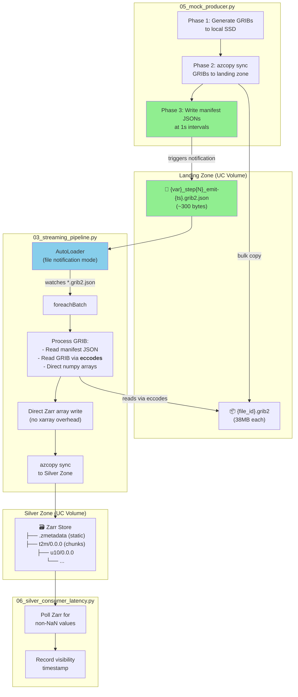

```mermaid
%%{init: {'theme': 'default'}}%%
flowchart TB

    subgraph Producer["05_mock_producer.py"]
        P1["Phase 1: Generate GRIBs<br/>to local SSD"]
        P2["Phase 2: azcopy sync<br/>GRIBs to landing zone"]
        P3["Phase 3: Write manifest JSONs<br/>at 1s intervals"]
        P1 --> P2 --> P3
    end

    subgraph LandingZone["Landing Zone (UC Volume)"]
        GRIB["📦 {file_id}.grib2<br/>(38MB each)"]
        MANIFEST["📄 {var}_step{N}_emit-{ts}.grib2.json<br/>(~300 bytes)"]
    end

    subgraph Pipeline["03_streaming_pipeline.py"]

        AL["AutoLoader<br/>(file notification mode)"]
        BATCH["foreachBatch"]
        PROC["Process GRIB:<br/>- Read manifest JSON<br/>- Read GRIB via <b>eccodes</b><br/>- Direct numpy arrays"]
        WRITE["Direct Zarr array write<br/>(no xarray overhead)"]
        SYNC["azcopy sync<br/>to Silver Zone"]
        
        AL -->|"watches *.grib2.json"| BATCH
        BATCH --> PROC --> WRITE --> SYNC
    end

    subgraph SilverZone["Silver Zone (UC Volume)"]
        ZARR["🗃️ Zarr Store<br/>├── .zmetadata (static)<br/>├── t2m/0.0.0 (chunks)<br/>├── u10/0.0.0<br/>└── ..."]
    end

    subgraph Consumer["06_silver_consumer_latency.py"]
        POLL["Poll Zarr for<br/>non-NaN values"]
        MEASURE["Record visibility<br/>timestamp"]
        POLL --> MEASURE
    end

    P2 -->|"bulk copy"| GRIB
    P3 -->|"triggers notification"| MANIFEST
    MANIFEST --> AL
    PROC -->|"reads via eccodes"| GRIB
    SYNC --> ZARR
    ZARR --> POLL

    style P3 fill:#90EE90
    style MANIFEST fill:#90EE90
    style AL fill:#87CEEB

```