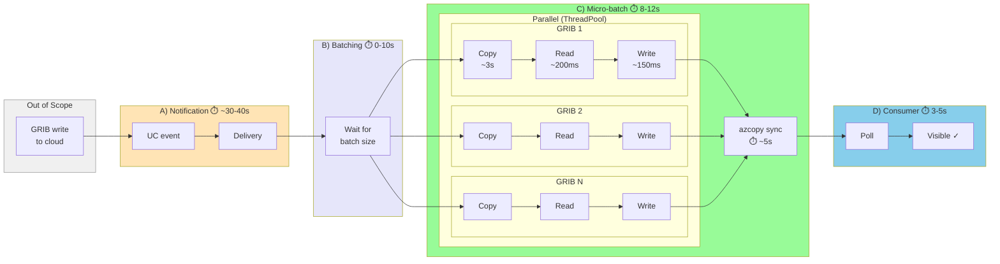

```mermaid
%%{init: {'theme': 'default'}}%%
flowchart LR
    subgraph OS["Out of Scope"]
        style OS fill:#f0f0f0,stroke:#999
        INIT["GRIB write<br/>to cloud"]
    end

    subgraph A["A) Notification ⏱️ ~30-40s"]
        style A fill:#FFE4B5
        A1["UC event"] --> A2["Delivery"]
    end

    subgraph B["B) Batching ⏱️ 0-10s"]
        style B fill:#E6E6FA
        B1["Wait for<br/>batch size"]
    end

    subgraph C["C) Micro-batch ⏱️ 8-12s"]
        style C fill:#98FB98
        subgraph C2["Parallel (ThreadPool)"]
            direction TB
            subgraph GRIB1["GRIB 1"]
                C1a["Copy<br/>~3s"] --> C2a["Read<br/>~200ms"] --> C3a["Write<br/>~150ms"]
            end
            subgraph GRIB2["GRIB 2"]
                C1b["Copy"] --> C2b["Read"] --> C3b["Write"]
            end
            subgraph GRIB3["GRIB N"]
                C1c["Copy"] --> C2c["Read"] --> C3c["Write"]
            end
           
        end
        
        C3a & C3b & C3c --> C4["azcopy sync<br/>⏱️ ~5s"]
    end

    subgraph D["D) Consumer ⏱️ 3-5s"]
        style D fill:#87CEEB
        D1["Poll"] --> D2["Visible ✓"]
    end

    INIT --> A1
    A2 --> B1
    B1 --> C1a & C1b & C1c
    C4 --> D1
```