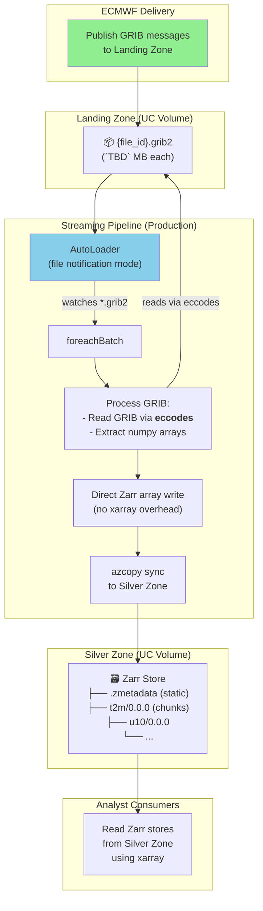

```mermaid
%%{init: {'theme': 'default'}}%%
flowchart TB

    subgraph Producer["ECMWF Delivery"]
        P1["Publish GRIB messages<br/>to Landing Zone"]
    end

    subgraph LandingZone["Landing Zone (UC Volume)"]
        GRIB["📦 {file_id}.grib2<br/>(`TBD` MB each)"]
    end

    subgraph Pipeline["Streaming Pipeline (Production)"]

        AL["AutoLoader<br/>(file notification mode)"]
        BATCH["foreachBatch"]
        PROC["Process GRIB:<br/>- Read GRIB via <b>eccodes</b><br/>- Extract numpy arrays"]
        WRITE["Direct Zarr array write<br/>(no xarray overhead)"]
        SYNC["azcopy sync<br/>to Silver Zone"]
        
        AL -->|"watches *.grib2"| BATCH
        BATCH --> PROC --> WRITE --> SYNC
    end

    subgraph SilverZone["Silver Zone (UC Volume)"]
        ZARR["🗃️ Zarr Store<br/>├── .zmetadata (static)<br/>├── t2m/0.0.0 (chunks)<br/>├── u10/0.0.0<br/>└── ..."]
    end

    subgraph Consumers["Analyst Consumers"]
        ANALYSTS["Read Zarr stores<br/>from Silver Zone<br/>using xarray"]
    end

    P1 --> GRIB
    GRIB --> AL
    PROC -->|"reads via eccodes"| GRIB
    SYNC --> ZARR
    ZARR --> ANALYSTS

    style P1 fill:#90EE90
    style AL fill:#87CEEB

```
